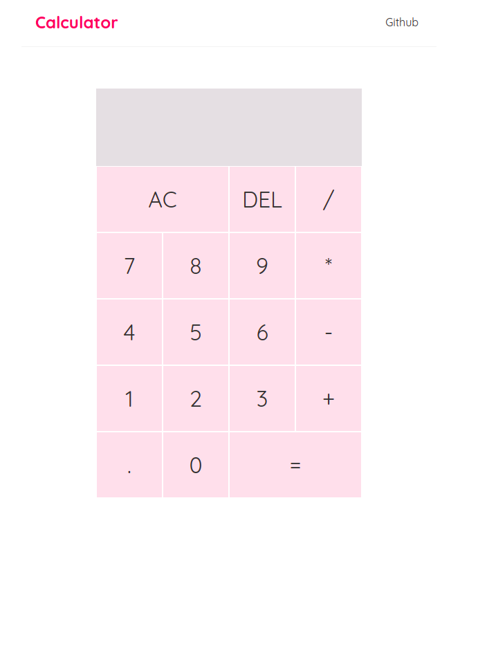

# Cool-Calculator
Simple calculator built with ReactJS 


## Usage
```
git clone https://github.com/hmtcelik/cool-calculator.git
cd cool-calculator
```
and then

```
npm install
npm start
```
if `npm install` doesnt work, use:
`npm install npm`

## Test
<a href="https://hmtcelik.github.io/cool-calculator/" target="_blank">Go to website</a>

# In App


